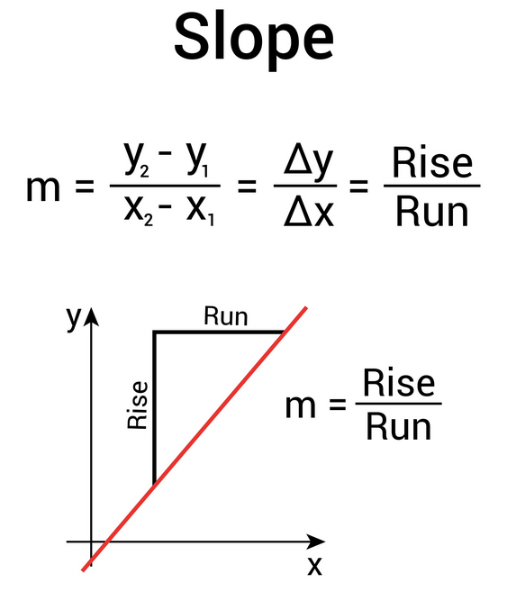

# Terrain Modeling and Cost Functions

Este documento detalha a metodologia de conversão de dados topográficos brutos em uma estrutura de grafo ponderado, adequada para algoritmos de caminho mínimo como Dijkstra e A*.  

A modelagem ultrapassa a simples conectividade de grade, integrando restrições físicas e custos energéticos para simular a navegação de um agente sobre um relevo não-uniforme.

---

## 1. Representação do Terreno (Reconstrução via Odometria)

No contexto de navegação robótica baseada em inerciais, não partimos de um mapa topográfico pré-existente (como imagens de satélite). O terreno é reconstruído progressivamente a partir da odometria estimada pelo modelo TinyML. Portanto, a representação do terreno não é estática, mas derivada da trajetória histórica do agente.

### 1.1. Representação Formal: Da Trajetória ao Grid

Seja $$T$$ a sequência de poses estimadas pelo modelo de odometria no tempo $$t$$:

$$
T={(x_t,y_t,z_t)∣t=0,…,T}
$$

O terreno é modelado como uma matriz de ocupação e elevação $$H \in (\mathbb{R} \cup \{\emptyset\})^{m \times n}$$, onde cada célula representa uma região do espaço físico discretizado. Diferente de imagens comuns, esta matriz deve ser capaz de representar áreas que ainda não foram exploradas (ou seja, áreas desconhecidas).

$$
H = \begin{bmatrix}
h_{0,0} & \dots & h_{0,n-1} \\
\vdots & \ddots & \vdots \\
h_{m-1,0} & \dots & h_{m-1,n-1}
\end{bmatrix}
$$

Inicialmente, todo o conhecimento do mundo é nulo (terra incognita):

$$
\forall (i,j), H_{i,j} = \emptyset
$$

A matriz é preenchida pela projeção da trajetória $$T$$ no plano 2D. Para uma pose $$(x_t,y_t,z_t)$$, a célula correspondente ($$i_t$$,$$j_t$$) é atualizada:

$$
H_{i_t,j_t} \leftarrow f(H_{i_t,j_t}, z_t)
$$

Onde $$f$$ é uma função de fusão de dados(média móvel ou último valor) que lida com visitas repetidas à mesma célula (loop closure).

### 1.2. Resolução Espacial e Escala $$\(\delta\)$$

A matriz é *adimensional* em seus índices. Para conferir significado físico, definimos a resolução espacial $$\(\delta\)$$ (metros/pixel). A resolução define o nível de detalhe e o tamanho dos obstáculos detectáveis:

- $$\(\delta\)$$ muito grande: Perda de fidelidade (obstáculos pequenos desaparecem, aliasing topográfico).

- $$\(\delta\)$$ muito pequeno: Explosão combinatória no número de nós do grafo ($$N=m\times n$$), elevando o custo computacional do Dijkstra/A*.

### 1.3. Mapeamento Índice ↔ Espaço Físico

É importante distinguir entre a posição no array (memória) e a posição no mundo (física). Para converter as coordenadas do mundo real $$(x,y)$$ para os índices da matriz $$(i,j)$$, utilizamos uma transformação linear que considera a resolução e a origem do sistema:

$$
\begin{cases}
j=⌊\frac{\delta_x-x_{min}}{\delta}⌋\\
i=⌊\frac{\delta_y-y_{max}-y}{\delta}⌋
(se\ a\ origem\ da\ imagem\ for\ top-left)\\
\end{cases}
$$

> Nota: O uso de $$x_{min}$$ e $$y_{max}$$ é necessário para garantir que coordenadas negativas da odometria (ex.: o robô andou para trás do ponto de partida) sejam mapeadas corretamente para índices positivos de array.

### 1.4. Tipologia dos Dados de Entrada

Os experimentos neste projeto utilizam três categorias de dados para validar a robustez do algoritmo::

**a. Dados Sintéticos (Procedurais):**

- Gerados via Ruído de Perlin ou Simplex Noise.

- Característica: Gradientes suaves, contínuos e diferenciáveis. Ótimos para testar a estabilidade do algoritmo em encostas progressivas.

**b. Dados Determinísticos (Hard-coded):**

- Matrizes desenhadas à mão (ex: rampas perfeitas, escadas, "walls").

- Característica: Descontinuidades abruptas e geometria euclidiana perfeita. Usados para testes unitários e validação de corner cases.

**c. Dados Reais (Odometria Inercial / Dataset MAGF-ID):**

Neste projeto, os dados reais derivam de sistemas de navegação baseados em IMU (Inertial Measurement Unit), utilizando o dataset MAGF-ID. Diferente de uma varredura direta (LiDAR), a topografia aqui é inferida através da reconstrução de trajetória e atitude do agente:

- Fonte: Acelerômetros, giroscópios e magnetômetros.
- Processo: A matriz $$H$$ é gerada pela projeção da pose estimada $$\left(x_t,y_t,z_t\right)$$ no grid 2D.
- Características Críticas:
    - Deriva (Drift): Ao contrário do erro local do LiDAR, o erro do IMU é cumulativo. Pequenos desvios na estimativa de inclinação ($$\theta$$) podem gerar grandes discrepâncias de altura ($$\Delta z$$) ao longo de trajetos longos.
    - Suavidade vs. Ruído Mecânico: O IMU capta vibrações do chassi que não correspondem ao relevo. O mapa resultante exige filtragem para distinguir o que é "rampa" do que é "trepidação".
    - Esparsidade: Dados de odometria geram "trilhas". Para obter a matriz $$H^{m\times n}$$ completa, é necessário aplicar técnicas de interpolação espacial, como Kriging ou Inverse Distance Weighting, nas áreas não visitadas, ou limitar o grafo apenas às regiões navegadas.

Importante:
Ao usar dados de IMU para gerar o terreno H, precisamos ter cuidado redobrado com o eixo $$Z$$.

- O problema da "Gravidade Fantasma": Sensores IMU de baixo custo muitas vezes confundem aceleração lateral (curva) com inclinação (gravidade), o que pode criar "morros virtuais" no mapa onde o terreno é, na verdade, plano.

- Consistência Global: Se o dataset MAGF-ID consistir em vários loops sobre a mesma área, a altura $$z$$ no início e no fim do loop pode não bater devido ao drift (o robô "acha" que subiu ou desceu, mas voltou ao mesmo lugar).

- (Pré-processamento): Talvez seja necessário uma etapa explícita de "nivelamento" ou correção de loop-closure se o mapa parecer inclinado artificialmente.

---

## 2. Topologia e Vizinhança (Grafo de Grade)

Uma vez definida a matriz $$H$$, o passo seguinte é convertê-la em uma estrutura topológica navegável: um grafo $$G=(V,E)$$. Esta conversão determina os "graus de liberdade" cinemáticos do agente dentro da simulação discreta.

### 2.1. Definição de Vértices (V)

Nem toda célula da matriz torna-se um nó do grafo. Em mapas gerados por odometria (esparsos), distinguimos células válidas de células vazias. O conjunto de vértices $$V$$ é definido apenas pelas células contendo dados de elevação válidos:

$$
V={v_{i,j}\mid H_{i,j}\neq NaN}
$$

Isso implica que o grafo resultante não é necessariamente uma grade regular perfeita; ele pode conter "ilhas", "túneis" ou componentes desconexos, dependendo da qualidade da trajetória de entrada.

### 2.2. Definição de Arestas ($E$) e Conectividade

As arestas definem as transições permitidas. Existem duas topologias padrão para grids quadrados:

**a. 4-Vizinhos (Von Neumann):**

Conecta apenas células ortogonais (Cima, Baixo, Esquerda, Direita).
- Métrica induzida: Distância Manhattan ($L_1$).
- Problema: O robô não pode fazer curvas suaves; para ir à diagonal, precisa fazer um "zigue-zague" (staircasing), superestimando a distância real em fator de $\sqrt{2} \approx 1.41$ no pior caso.

**b. 8-Vizinhos (Moore) - Adotado neste Projeto**

Conecta células ortogonais e diagonais.

$$
N_8(i,j) = \{ (k,l) \in V \mid \max(|k-i|, |l-j|) = 1 \}
$$

- Métrica induzida: Distância Chebyshev ($L_\infty$), aproximando-se da Euclidiana ($L_2$) quando os custos são ponderados.
- Vantagem Robótica: Permite aproximações de movimentos de 45°, essenciais para suavizar trajetórias de veículos reais.

### 2.3. Condição de Existência da Aresta

Uma aresta $e = (u, v)$ só existe no conjunto $E$ se ambas as condições forem atendidas: 

1. Adjacência Geométrica: $v$ está no conjunto $N_8(u)$. 
2. Validade dos Dados: Tanto $H_u$ quanto $H_v$ são números reais válidos (não são NaN).

> Nota sobre "Cutting Corners": Em uma topologia de 8-vizinhos, mover-se na diagonal entre dois obstáculos (ou paredes) pode ser geometricamente possível no grafo, mas fisicamente impossível para um robô com largura > 0. Para este estudo algorítmico, assumimos o robô como um ponto material. Em um sistema de produção, seria necessário inflar os obstáculos (Costmap Inflation) antes de gerar o grafo.

### 2.4. Resumo da Estrutura

O grafo resultante $G$ possui as seguintes propriedades:
- Não-direcionado (inicialmente): Se posso ir de A para B, a aresta existe de B para A.
- Grau Máximo: 8 (em áreas abertas).
- Grau Mínimo: 1 (em pontas de corredores sem saída/dead-ends da odometria).

---

## 3. Geometria do Movimento (Distância Euclidiana 3D)

Diferente de abordagens clássicas de grid-world que consideram apenas a distância planar (Manhattan ou Euclidiana 2D), este projeto calcula a distância física real percorrida pelo agente no espaço tridimensional. Isso é fundamental para a Odometria Inercial, pois o erro do sensor acumula-se sobre a trajetória percorrida ($$d_{3D}$$), e não sobre sua sombra projetada no chão ($$d_{xy}$$).

### 3.1. Distância Planar Base ($$d_{xy}$$)

Seja uma aresta conectando o nó atual $u=(i,j)$ a um vizinho $v=(k,l)$. A distância horizontal entre os centros das células, considerando a resolução espacial $\delta$, é:

$$
d_{xy}(u,v) = \delta \cdot \sqrt{(k-i)^2 + (l-j)^2}
$$

Dada a topologia de 8-vizinhos (Moore), isso simplifica para dois casos discretos:
- Movimento Ortogonal: $d_{xy} = \delta$
- Movimento Diagonal: $d_{xy} = \delta \sqrt{2} \approx 1.414 \cdot \delta$

### 3.2. Diferença de Cota ($\Delta h$)

A variação de altura entre os nós é obtida diretamente da matriz de elevação:

$$
\Delta h = H_{k,l} - H_{i,j}
$$

### 3.3. Distância Real Percorrida ($d_{3D}$)

Aplicando o Teorema de Pitágoras em 3 dimensões, obtemos o comprimento físico da aresta. Este será o peso base ($w_{base}$) do grafo antes de aplicarmos penalidades de esforço:

$$
d_{3D}(u,v) = \sqrt{d_{xy}^2 + \Delta h^2}
$$

### 3.4. Impacto no Pathfinding

A utilização de $$d_{3D}$$ introduz uma penalização geométrica implícita:

- Caminho Mínimo Real: O algoritmo priorizará, *ceteris paribus*, terrenos planos em vez de terrenos acidentados, simplesmente porque a hipotenusa de uma rampa é mais longa que o cateto base.

- Consistência com a Física: Se $$\Delta h$$ for muito grande (um muro vertical), $$d_{3D}$$ aumenta significativamente, mas não o suficiente para impedir o movimento sozinho. Por isso, precisaremos das restrições de inclinação na próxima seção.

**Caso: "Rampa vs. Degrau" e Navegação em Escombros**

Contexto: Uma empresa especializada em robôs de resgate foi contratada pela Defesa Civil para implantar robôs de resgate em escombros. O robô (TinyML Rover) utiliza apenas odometria inercial para mapear o ambiente, pois a fumaça bloqueia câmeras e LiDARs.

O Problema: O robô está na posição *A* e precisa chegar em *B*. O sistema detectou duas rotas possíveis no grid reconstruído. O algoritmo precisa decidir qual aresta explorar primeiro baseando-se no custo físico real.

Dados de Entrada:

- Resolução ($\delta$): $0.5$ metros (cada célula tem $50 \times 50$ cm).
- Matriz de Elevação Local ($H$):

$$
H = \begin{bmatrix}
 0.0 & 0.0 & \mathbf{2.0} \\
 0.0 & 0.0 & 0.5 \\
 \mathbf{0.0} & 0.0 & 0.0
 \end{bmatrix}
 $$
 
 (Onde $H_{2,0}$ é a posição atual do robô $A$ e ele avalia vizinhos).
 
 Cenário 1: O "Atalho" Vertical (Obstáculo)
 O robô avalia mover-se para a célula $(0,2)$ (canto superior direito), onde há um escombro de $2.0m$ de altura.

 - Deslocamento Planar ($d_{xy}$): Digamos que a distância no grid seja 2 células (1.0m).
 - Desnível ($\Delta h$): $2.0m - 0.0m = 2.0m$.
 - Custo Real ($d_{3D}$):
 
 $$
 d_{3D} = \sqrt{1.0^2 + 2.0^2} = \sqrt{5} \approx \mathbf{2.23\,m}
 $$
 
 (Nota: O caminho mais que dobrou de tamanho devido à altura).
 
 Cenário 2: A Rampa SuaveO robô avalia mover-se para a célula $(1,2)$ (meio direito), onde a altura é $0.5m$.
 
 - Deslocamento Planar ($d_{xy}$): A mesma distância de grade (1.0m).
 Desnível ($\Delta h$): $0.5m - 0.0m = 0.5m$.
 - Custo Real ($d_{3D}$):
 
 $$
 d_{3D} = \sqrt{1.0^2 + 0.5^2} = \sqrt{1.25} \approx \mathbf{1.11\,m}
 $$
 
 > Conclusão do Algoritmo:
 > Embora visualmente no mapa 2D ("top-down") as células pareçam equidistantes, o cálculo da Geometria 3D revela que o Cenário 1 custa 100% mais energia/distância para ser transposto do que o Cenário 2.O algoritmo de Dijkstra, alimentado por esses pesos, naturalmente evitará o escombro alto, direcionando o robô para a rampa suave, mimetizando o comportamento de um operador humano experiente.

---

## 4. Análise de Inclinação e Transversalidade

Agora chegamos ao momento de "vida ou morte" para o algoritmo. Enquanto a Seção 3 calculava o esforço, a Seção 4 decide a possibilidade. Se não implementarmos isso, o Dijkstra pode encontrar um caminho "ótimo" que envolve subir uma parede de 90 graus só porque é o trajeto mais curto.

Antes de atribuir um custo monetário ou energético a uma aresta, é necessário determinar a sua viabilidade física. Robôs possuem limites mecânicos intransponíveis ditados pelo torque dos motores, coeficiente de atrito das rodas e centro de massa. Nesta etapa, o grafo sofre uma "poda" baseada em geometria, transformando arestas geometricamente existentes em conexões logicamente nulas.

### 4.1. Cálculo da Inclinação Local (θ)

Para cada aresta potencial conectando $$u$$ a $$v$$, calculamos o ângulo de inclinação $$\(\theta\)$$ em relação ao plano horizontal.

Dada a diferença de altura $$\(|\Delta h|\)$$ e a distância planar $$d_{xy}$$:

$$
\theta = arctan(d_{xy} \cdot |\Delta h|)
$$

Onde $$\(\theta \in \left[0, \frac{\pi}{2}\right)\)$$.

A inclinação é definida por:

$$
m = \frac{\Delta y}{\Delta x}
$$

onde:
- $\Delta y$ é o *rise*
- $\Delta x$ é o *run*

### 4.2. Critério de Transversalidade (Hard Constraint)

Definimos um ângulo crítico $$\theta_{max}$$ (ou $$θ_{crit}$$), que representa o limite operacional do agente. A função de transversalidade da aresta é binária:

$$
\text{Transponível}(u, v) =
\begin{cases}
\text{True},  & \text{se } \theta \le \theta_{\max} \\
\text{False}, & \text{se } \theta > \theta_{\max}
\end{cases}
$$

Se $$\text{Transponível}(u, v)$$ for *False*, o peso da aresta torna-se infinito $$(w = \infty)$$, ou, mais eficientemente, a aresta é removida da lista de adjacência.

> Nota: Em sistemas de odometria inercial, picos de ruído no eixo Z podem criar "agulhas" falsas no terreno que excedem $$\theta_{max}$$. É comum aplicar uma tolerância ($$\epsilon$$) ou um filtro de suavização antes deste passo para evitar que o robô fique preso em "paredes de ruído".

**Caso: Decisão de Segurança**

Contexto: Continuando a operação de resgate, o robô está diante das mesmas opções, mas agora o algoritmo possui as especificações técnicas do chassi:

- Limite de Tração ($$\theta_{max}$$): $$45^\circ$$ ($$\frac{\pi}{4}$$ rad). Acima disso, o robô capota para trás.
- Resolução ($$\delta$$): 1.0 metro (para simplificar o cálculo).

Revisão do Cenário 1: O "Atalho" Vertical (Escombros)

- Dados: $$\Delta h=2.0m$$, $$d_{xy}=1.0m$$.
- Cálculo do Ângulo:

$$
\theta = \arctan\!\left(\frac{2.0}{1.0}\right) \approx 63.4^\circ
$$

Verificação: $$63.4^\circ > 45^\circ$$.

Decisão: VIOLAÇÃO DE SEGURANÇA. A aresta é removida. Para o grafo, o caminho direto através do escombro não existe, mesmo sendo o caminho mais curto em metros.

Revisão do Cenário 2: A Rampa Suave

Dados: $$\Delta h=0.5m$$, $$d_{xy}=1.0m$$.

Cálculo do Ângulo:

$$
\theta = \arctan\!\left(\frac{0.5}{1.0}\right) \approx 26.5^\circ
$$

Verificação: $$26.5^\circ \leq 45^\circ$$.

Decisão: APROVADO. A aresta permanece no grafo e seu custo será calculado (na próxima seção).

Impacto na Navegação: Graças a isso, o algoritmo de Dijkstra nem sequer considerará escalar o escombro. Ele será forçado a contornar o obstáculo ou pegar a rampa, garantindo não apenas a otimização da rota, mas a sobrevivência do robô.

---

## 5. Função de Custo Composta (Custo de Esforço)

Se a Seção 3 definiu a distância e a Seção 4 a viabilidade, a Seção 5 define a preferência. Aqui transformamos o grafo de uma representação geométrica para uma representação de esforço. Para um sistema de odometria e robótica, a distância mais curta nem sempre é a melhor. Muitas vezes, um desvio longo pelo plano economiza mais bateria (e oferece menos risco de derrapagem) do que uma subida curta e íngreme.

Uma vez que a aresta $$(u,v)$$ foi validada como transponível $$(\theta\leq\theta_{max})$$, precisamos atribuir um peso numérico $$w(u,v)$$ que guiará a busca do algoritmo de Dijkstra.

O peso não representa apenas distância (metros), mas sim o Custo Generalizado de Travessia, que pode ser interpretado como consumo de energia, tempo ou risco acumulado.

### 5.1. A Equação Geral do Custo

Definimos o custo da aresta como a distância física $$d_{3D}$$ modulada por um fator de penalidade associado à inclinação:

$$
w(u,v)=d_{3D}(u,v)\cdot(1+\alpha\cdot P(\theta))
$$

Onde:

- $$d_{3D}$$: Custo base geométrico (calculado na Seção 3).
- $$\alpha$$ (Alpha): Fator de sensibilidade (parâmetro de calibração).
    - Se $$\alpha=0$$, o terreno é tratado como se fosse plano (apenas distância importa).
    - Se $$\alpha≫1$$, o robô evitará inclinações a todo custo.
- $$P(\theta)$$: Função de penalidade normalizada baseada no ângulo de inclinação.

### 5.2. Modelos de Penalidade $$(P(\theta))$$

Dependendo da física do robô e da natureza dos dados (IMU ruidoso vs. LiDAR limpo), adotamos estratégias diferentes:

#### A. Modelo Linear (Soft Penalty)

Adequado para robôs com torque sobrando ou terrenos onde a aderência é constante. O custo cresce proporcionalmente ao ângulo.

$$
P_{linear}(\theta)=\frac{\theta_{max}}{\theta}
$$

#### B. Modelo Exponencial (Hard Penalty - Realista)

Adequado para simular o comportamento real de motores elétricos (onde a corrente sobe exponencialmente perto do limite de torque) ou risco de deslizamento em terrenos soltos (cascalho/areia).

$$
P_{exp}(\theta)=\exp\left(\beta\cdot\frac{\theta_{max}}{\theta}\right)-1
$$

Onde $$\beta$$ controla a agressividade da curvatura do custo.

### 5.3. Tratamento de Ruído (Zona Morta)

Considerando que os dados provêm de Odometria Inercial (MAGF-ID), pequenas oscilações de $$\theta$$ (ex: 1∘ a 3∘) são frequentemente ruído de sensor ou vibração, e não relevo real.

Para evitar que o algoritmo zigue-zagueie tentando evitar "ruído", aplicamos uma Zona Morta ($$\theta_{min}$$):

$$
P(\theta)=0\quad\text{se }\theta<\theta_{min}\approx5^\circ
$$

Sem isso, o mapa inercial cheio de micro-tremidas faria o custo flutuar loucamente, e o caminho resultante seria errático.

**Caso: Batalha por Eficiência**

Contexto: O robô rejeitou a parede vertical. Agora, ele precisa escolher entre duas rotas válidas para chegar ao destino final. O parâmetro de calibração do sistema é $$\alpha=10.0$$ (o robô é pesado e odeia subir ladeiras).

Opção A: A Rampa Direta (Curta mas Íngreme)

- Dados: Distância $$d_{3D}=1.11m$$, Inclinação $$\theta=26.5^\circ$$ ($$\approx0.46$$ rad).
- Limite: $$\theta_{max}=45^\circ$$.
- Razão: $$\frac{\theta_{max}}{\theta}=\frac{45}{26.5}\approx0.59$$.
- Custo (Linear): 

$$
w_A=1.11\cdot(1+10\cdot0.59)=1.11\cdot(6.9)\approx7.66
$$

Opção B: O Contorno Longo (Longo mas Plano) 

Existe um caminho alternativo pelo chão plano que dá a volta no obstáculo.

- Dados: Distância $$d_{3D}=3.50m$$, Inclinação $$\theta\approx0^\circ$$.
- Penalidade: $$P(0)=0.$$
- Custo: 

$$
w_B=3.50\cdot(1+0)=3.50
$$

> Decisão do Algoritmo: 
> Embora a Opção A (1.11m) seja 3x mais curta fisicamente que a Opção B (3.50m), o custo energético calculado (7.66 vs 3.50) indica que subir a rampa é energeticamente proibitivo.

O Dijkstra selecionará a Opção B. O robô fará o caminho mais longo, economizando bateria e reduzindo o desgaste mecânico. Isso demonstra a "inteligência" emergente da função de custo bem modelada.

### 5.4. Garantia de Correção (Não-Negatividade)

Para que o Dijkstra funcione, é imperativo que $$w(u,v)≥0$$. A nossa formulação garante isso estruturalmente:

- $$d_{3D}\geq\delta>0$$ (sempre positivo).
- $$\alpha\geq0$$ e $$P(\theta)\geq0$$ (penalidades aditivas).

Logo, não existem arestas de peso negativo, impedindo ciclos infinitos de redução de custo.

---

## 6. Assimetria de Custo (Direcionalidade)

Em cenários de alta fidelidade, o grafo é direcionado ($$w(u,v)\neq w(v,u)$$).

- Subida ($$\Delta h>0$$): Custo alto (trabalho contra a gravidade).

- Descida ($$\Delta h<0$$):

    - Caso Simples: Custo reduzido (ajuda da gravidade).

    - Caso Robótico: Custo moderado (necessidade de frenagem ativa para não perder controle).

Para este projeto, adotamos uma Penalização Simétrica Conservadora (assumindo que descer uma ladeira íngreme é tão perigoso/custoso quanto subi-la), garantindo robustez e simplificando a heurística para o A*.

---

## 7. Propriedades Formais do Grafo Resultante

O processo de modelagem resulta em um grafo $$G=(V,E,w)$$ com as seguintes garantias para o algoritmo de Dijkstra:

1. Não-Negatividade: $$w(e)\geq 0$$ para todo $$e\in E$$. Isso é garantido pois $$d_{3D}>0$$ e os termos de penalidade são positivos.

2. Conectividade Variável: A matriz densa torna-se um grafo esparso dependendo dos obstáculos ($$\theta>\theta_{max}$$).

3. Determinismo: O mesmo input $$H$$ sempre gera o mesmo grafo $$G$$.

---

## 8. Considerações de Implementação

Ao construir a matriz de adjacência ou lista de adjacência:

- Normalização: É recomendável normalizar as altitudes para a escala do grid se H vier de dados reais (ex: GeoTIFF), evitando que $$\Delta h$$ domine completamente $$d_{xy}$$.

- NaN Handling: Células com valor $$\text{NaN}$$ no input representam buracos ou áreas desconhecidas e são isoladas (grau 0).

---
Esta modelagem física serve como a "verdade" (ground truth) para os custos de movimentação. No próximo módulo (Pathfinding Algorithms), utilizaremos este grafo para comparar a eficiência de exploração do Dijkstra versus a busca direcionada do A*, onde a escolha da heurística $$h(n)$$ precisará ser consistente com a função de custo $$w(u,v)$$ aqui definida.

---

## 9. Preparação para os Experimentos

Os arquivos em `data/` incluem:

- terrenos sintéticos simples para validação;
- terrenos mais variados para análise visual.

Esses arquivos serão usados no documento:

- `05-experiments-and-results.md`

e no notebook:

- `01_exploratory_terrain_and_paths.ipynb`.

---

## 10. Continuidade com A\*

Esta modelagem será reutilizada no próximo módulo (A\*), portanto, a qualidade desta fase impacta diretamente o módulo seguinte.

